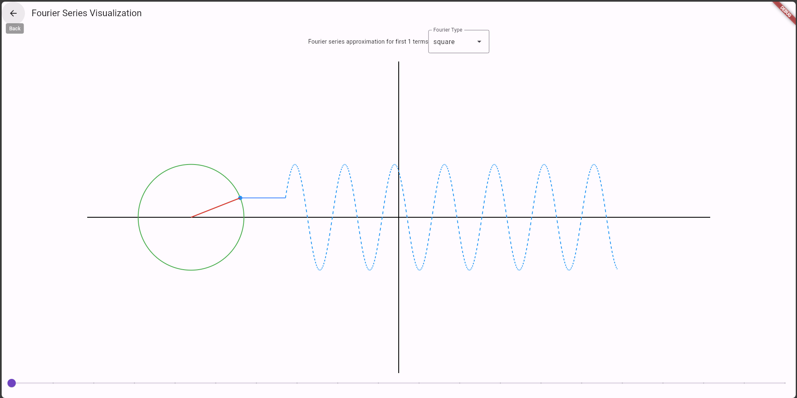
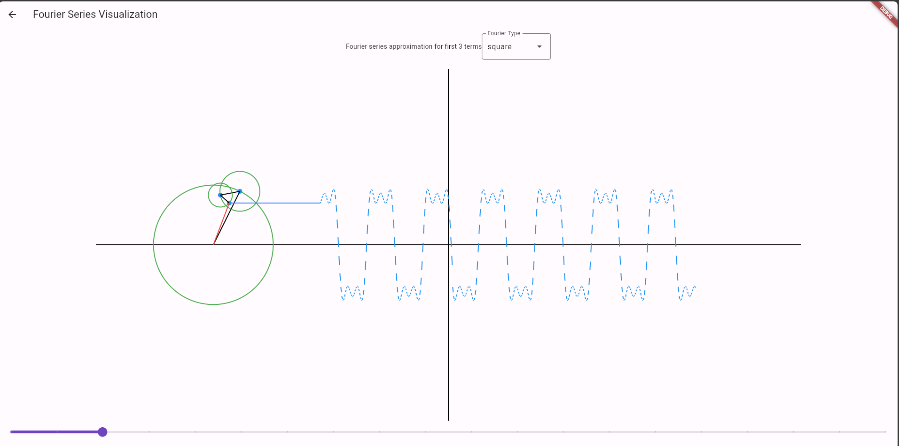
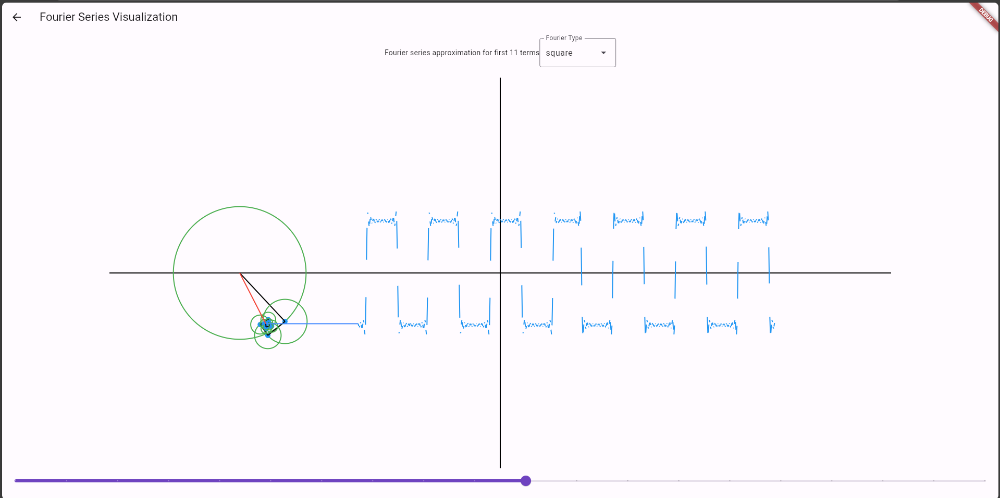
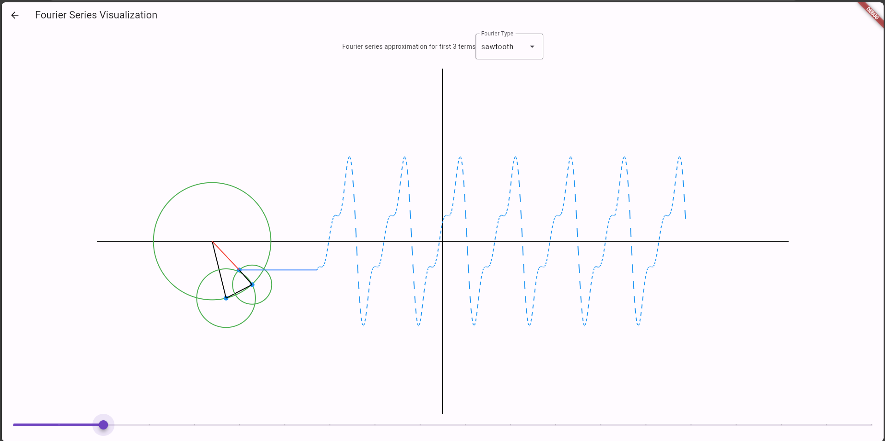
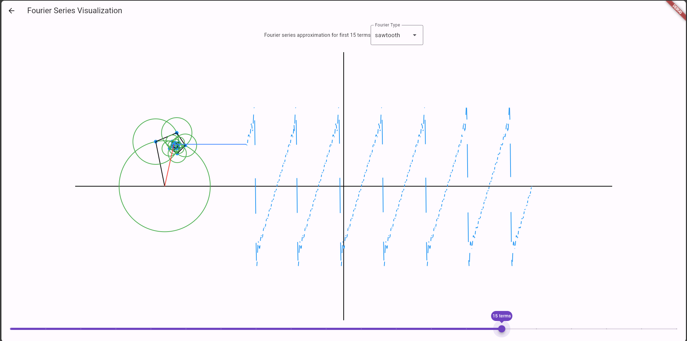

# flutter_fourier_series_test

A flutter project testing the UI and Animation functionality in Flutter based on the fourier series.
Basic Idea taken from the fourier series video from 3Blue1Brown on Youtube

## Getting Started
On the Left side A fairly minimal left navigation is present on the click of Hamburger Icon.
On there, go to Base fourier Tab.
The Base Fourier is a Circle with a constant movement producing a sine wave on its projection on left.
There you would find 2 fields, a Dropdown field at top selects which type of wave (square or Sawtooth).
A Slider at the bottom controls the number of circles.
The higher the number of circles, the more accurate the projection becomes.

the lines are generated as path from points, which is not rendering properly in screen-capture below for large movements,
for best experience,, download and run t locally.

#### Initial Sine Wave

#### Square Wave Initial

#### Square Wave with more precision

#### Sawtooth Wave Initial

#### Sawtooth Wave with more precision

## References and Inspirations

1. https://www.youtube.com/watch?v=r6sGWTCMz2k --  But what is a Fourier series? From heat flow to drawing with circles | DE4  BY 3Blue1Brown
2. https://www.youtube.com/watch?v=Mm2eYfj0SgA --  Coding Challenge 125: Fourier Series  BY The Coding Train
3. https://www.youtube.com/watch?v=vvI_NUXK00s --  Custom painting in Flutter - Flutter In Focus  BY Flutter
4. https://www.youtube.com/watch?v=Kmk7qXqYP3E&list=PLNF7sp688eT8gImxZlw4D0LhOwykuuskL&index=5 --  Draw Rectangle with rounded corners on canvas | Flutter  BY Flutter Artist